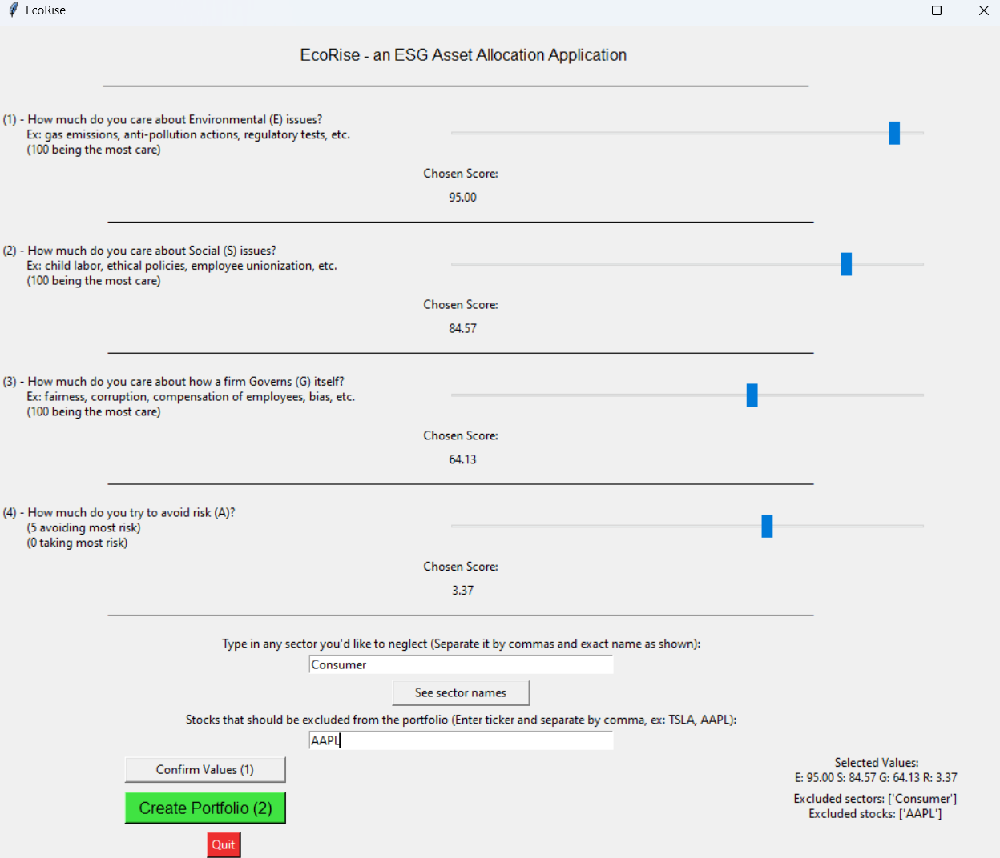
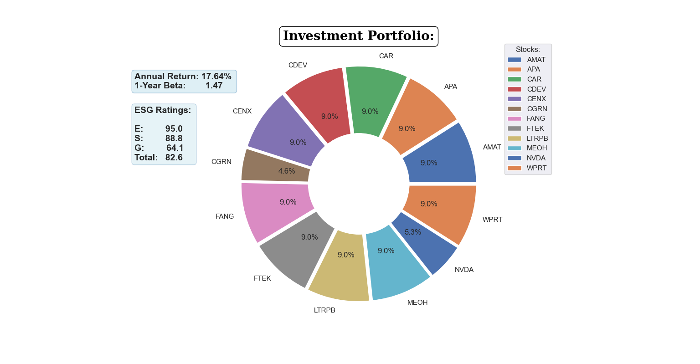

# ESG-Score-Integration: Ethically Responsible Investment Portfolio Generator

This project focuses on integrating ethically responsible criteria into investment portfolios using proprietary **ESG (Environmental, Social, and Governance)** scores. The repository provides a GUI application that allows users to create an equity investment portfolio based on their ESG preferences, along with comprehensive documentation of the data gathering and ESG score-building processes. 

---

##  Overview  
### Key Features:
- **GUI Application**: An intuitive interface to input ESG criteria and generate a personalized equity investment portfolio.  
- **Custom ESG Scores**: Proprietary ESG scores are built using a systematic methodology for each stock.  
- **Data Integration**: Processes include daily stock price analysis, market capitalization, and the Fama-French 3-Factor model for robust portfolio creation.

---

##  How It Works  
1. **User Input**  
   Users provide their ESG preferences through an intuitive GUI application.  
     

2. **Algorithm**  
   The application processes:  
   - User preferences  
   - ESG scores  
   - Financial data (e.g., stock prices, market capitalization)  

   It then uses a robust algorithm to generate an optimized investment portfolio.  

3. **Output**  
   A detailed portfolio allocation tailored to the user's ethical and financial goals is displayed.  
     

<!-- ### Demo  
A detailed demonstration video of the platform and its portfolio generation capabilities can be included here. -->


---

##  Repository Structure  

### **1. Core Application**  
- **`esg_investing_application.py`**  
   - The Python script for building the GUI application and implementing the portfolio allocation algorithm.  

#### Required Data Files:  
- **`daily_prices.csv`**: Daily stock price data.  
- **`daily_spx.csv`**: Daily price data for the SPX Index (used for beta calculations).  
- **`env.csv`**: Sector/grouping information for each stock.  
- **`esg_scores.csv`**: ESG scores for the Nasdaq Composite Index stocks.  
- **`fama_french_data.csv`**: Fama-French 3-Factor model data.  
- **`mktcap.csv`**: Market capitalization data for stocks.

---

### **2. ESG Score Building**  
Location: `data/esg_scores`  
- Python scripts and Jupyter Notebook reports detailing the methodology for building ESG scores.  
- CSV files containing calculated ESG scores for Nasdaq Composite Index members.

---

### **3. Data Collection**  
#### **Stock and ESG Data**  
Location: `data/nasdaq-comp`  
- Python scripts and CSV files to gather ESG data via the Bloomberg Terminal.  

#### **Price Data**  
Location: `data/price-data`  
- Python scripts and CSV files to fetch daily stock and index price data from the Bloomberg Terminal.

---

##  Methodology  
### ESG Scoring:
1. Data is collected from the Bloomberg Terminal for Nasdaq Composite Index members.  
2. Scores for **Environmental (E)**, **Social (S)**, and **Governance (G)** criteria are computed and aggregated into a comprehensive ESG score.  
3. Results are stored in `esg_scores.csv` for integration into the portfolio generation process.

### Portfolio Construction:  
- Utilizes **beta**, **market cap**, and **ESG preferences** to optimize equity allocation.  
- Incorporates the **Fama-French 3-Factor model** for advanced portfolio analytics.

---

##  Future Enhancements  
- Expand ESG score coverage to global stock markets.  
- Add more advanced portfolio optimization techniques.  
- Include real-time data fetching for a live dashboard.

---

## ️ Installation & Usage  
### Prerequisites:  
- Python 3.x  
- Required libraries: `pandas`, `numpy`, `matplotlib`, `tkinter`, etc.  

### Steps:  
1. Clone the repository.  
   ```bash
   git clone https://github.com/BlackDevil559/EcoRise.git
   cd EcoRise
   ```
2. Install dependencies.
3. Run the GUI application.
    ```bash
    python esg_investing_application.py

##  Acknowledgments
- ESG data sourced via Bloomberg Terminal.
 
- Financial models inspired by the Fama-French methodology.

